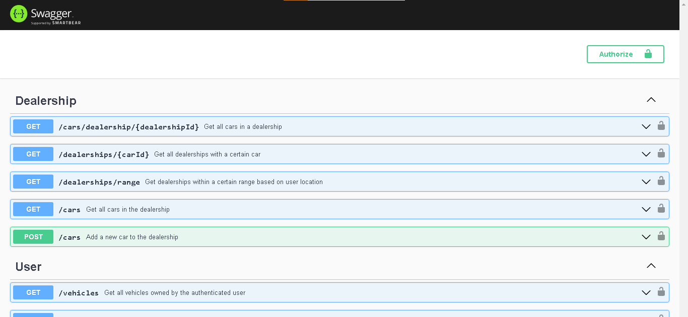

# Backend REST API Documentation

This documentation provides an overview of the RESTful APIs for a backend application developed in Node.js using the MongoDB native driver. The application includes functionalities for handling user, dealership, and authentication operations, along with car deals and vehicle ownership.

## Assignment Overview

The assignment requirements are as follows:

1. Implement admin, user, and dealership authentication using JWT (JSON Web Token).
2. Implement a mechanism to invalidate JWT to facilitate logout and password change.
3. Create REST endpoints for user and dealership operations.
4. Implement asynchronous error handling using promises for all API endpoints.
5. Use ES6 compatible code (ES modules) and avoid using the Mongoose library.
6. Use faker.js to generate dummy data.
7. Provide basic API documentation.

## Folder Structure

The backend application's folder structure is as follows:
```
backend-app/
|-- src/
| |-- config/
| | |-- db.mjs
| | |-- jwt.mjs
| | |-- index.mjs
| |-- controllers/
| | |-- authController.mjs
| | |-- userController.mjs
| | |-- dealershipController.mjs
| |-- middleware/
| | |-- authenticate.mjs
| |-- models/
| | |-- User.mjs
| | |-- Dealership.mjs
| | |-- DeaL.mjs
| | |-- SoldVehicles.mjs
| | |-- Car.mjs
| |-- routes/
| | |-- authRoutes.mjs
| | |-- userRoutes.mjs
| | |-- dealershipRoutes.mjs
| | |-- JSDoc.mjs
| |-- utils/
| | |-- error.mjs
| | |-- seed.mjs
| | |-- dummyData.mjs
| |-- app.mjs
| |-- swaggerDef.mjs
|-- .env
|-- .gitignore
|-- package.json
|-- package-lock.json
|-- README.md
|-- swagger.png
```
markdown
Copy code

## API Documentation

### User API Routes

- **GET /users/:userEmail/vehicles**
  Get all vehicles owned by a user.

- **GET /deals/:carId**
  Get all deals on a certain car.

- **POST /deals/buy/:dealId**
  Allow the user to buy a car after a deal is made.

- **GET /vehicles**
  Get all vehicles owned by the authenticated user.

### Dealership API Routes

- **GET /cars/dealership/:dealershipId**
  Get all cars in a dealership.

- **GET /dealerships/:carId**
  Get all dealerships with a certain car.

- **GET /dealerships/range**
  Get dealerships within a certain range based on user location.

- **GET /deals/:carId**
  Get all deals on a certain car.

- **POST /deals/buy/:dealId**
  Allow the user to buy a car after a deal is made.

## Usage

1. Install dependencies: `npm install`
2. Start the server: `npm start`
3. Access the API documentation: [http://localhost:3000/api-docs](http://localhost:3000/api-docs)
- 
## Technologies Used

- Node.js
- MongoDB
- MongoDB Atlas
- JSON Web Token (JWT)
- faker.js for dummy data generation

## Note

Please ensure you have set up the MongoDB connection string in the .env file before running the application.

This README.md file provides an overview of the backend application, along with the API routes available for users and dealerships. For more detailed information on each route's functionality and data structures, please refer to the code files and JSDoc comments in the respective controllers and routes.

For the entire assignment's detailed documentation, including the implementation details, setup instructions, and more, please refer to the actual code files and comments in the project.